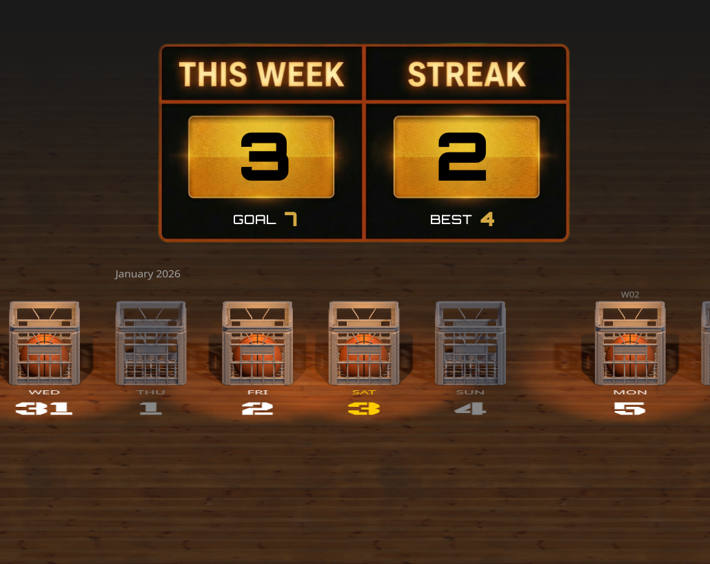

# Basketball Habit Tracker

A 3D habit tracker built with Three.js where each day is a milk crate. Complete a day by tossing a basketball into the crate with a satisfying arc animation.



## About This Repository

This is a **learning repository** designed to teach you how to build a 3D web application step by step. You can check out each branch to see how the project evolved, and follow along with the changes at your own pace.

From the [metal_sole](https://www.youtube.com/@metal_sole) YouTube channel.

<!-- TODO: Add video link and thumbnail -->

## How to Follow Along

### Checkpoint Branches

Check out each branch to see the project at different stages:

| Branch | Description |
|--------|-------------|
| `checkpoint/01-initial` | Starting point |
| `checkpoint/02-after-initial-build` | Initial build complete |
| `checkpoint/03-after-first-change` | After changes 1 |
| `checkpoint/04-after-changes-2` | After changes 2 |
| `checkpoint/05-after-changes-3` | After changes 3 |
| `checkpoint/06-after-changes-4` | After changes 4 |
| `checkpoint/07-after-changes-5` | After changes 5 |
| `checkpoint/08-after-changes-6` | After changes 6 |

```bash
git checkout checkpoint/01-initial  # Start here
```

### Documentation

The `docs/` folder contains everything you need to follow along:

```
docs/
├── initial_prd.md          # Original product requirements
├── 1_changes/              # First iteration
│   ├── changes_1_prd.md    # What we're building
│   ├── issues.md           # Problems encountered
│   └── screenshot_*.png    # Reference images
├── 2_changes/              # Second iteration
├── 3_changes/              # Third iteration
├── 4_changes/              # Fourth iteration
├── 5_changes/              # Fifth iteration
└── 6_changes/              # Sixth iteration
    └── 6_5_changes/        # Sub-iteration
```

Each folder contains:
- A PRD (Product Requirements Document) describing what changes to make
- Screenshots used as reference for the AI or for visual guidance
- Any issues or notes from that stage

## Features

- **3D Calendar View** - Navigate through days with smooth infinite scrolling
- **Satisfying Interactions** - Click to throw a ball into the crate, click again to eject it
- **Persistent Storage** - Progress saved automatically to localStorage
- **Week/Month Labels** - Clear time structure with week numbers and month dividers
- **Today Highlight** - Current day prominently marked in gold
- **Streak Tracking** - Scoreboard displays weekly progress and current streak

## Quick Start

```bash
npm install
npm run dev
```

Open http://localhost:5173 in your browser.

## Usage

- **Scroll** (wheel or drag) to navigate through days
- **Click** a crate to mark the day complete (ball drops in)
- **Click again** to unmark (ball ejects)
- **`D`** key to show debugging panels (in the later branches)

## Tech Stack

- Three.js + TypeScript
- Vite
- Tween.js for animations
- troika-three-text for 3D labels

## Scripts

| Command | Description |
|---------|-------------|
| `npm run dev` | Development server |
| `npm run build` | Production build |
| `npm run preview` | Preview build |
| `npm run check` | Run all checks (types, lint, format) |

## License

MIT
